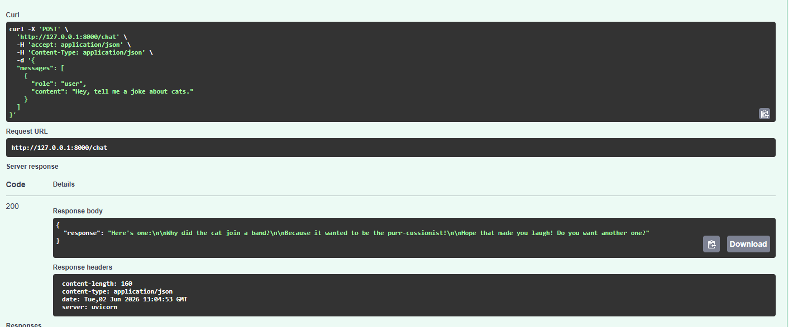

# FastAPI LangChain Ollama Chatbot

Basic chatbot backend built with FastAPI, LangChain, and Ollama.

## Requirements

- Python 3.10+
- [Ollama](https://ollama.com/) installed and running locally

## Setup

1. Create and activate a virtual environment:
   - Windows PowerShell:
     - `python -m venv venv`
     - `venv\Scripts\activate`
2. Install dependencies:
   - `pip install -r requirements.txt`
3. Pull a model in Ollama (example):
   - `ollama pull llama3.1`

## Run

Start the API:

`uvicorn main:app --reload`

Server will run at `http://127.0.0.1:8000`.

## API Endpoints

- `GET /health` - health check
- `POST /chat` - returns a chatbot response

### Example Request

`POST /chat`

```json
{
  "messages": [
    { "role": "user", "content": "Hello! Tell me a joke." }
  ]
}
```

### Example Response

```json
{
  "response": "Why don't scientists trust atoms? Because they make up everything."
}
```

## Optional Environment Variables

- `OLLAMA_MODEL` (default: `llama3.1`)
- `OLLAMA_BASE_URL` (default: `http://localhost:11434`)

## IT works!


